# Linter for CSS

> This project was mainly around creating a linter that will
> check for comments, missing semicolons at the end of every line
> and also checking for the initial period to designate a class

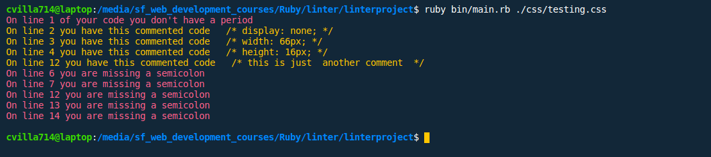

Additional description about the project and its features.

## Built With

- Ruby
- RSpec gem
- Colorize gem
- VS Code

## Getting Started

To get a local copy up and running follow these simple example steps.

- For starters you are going to need to clone the repo by clicking on the green button on top right corner that says "code"
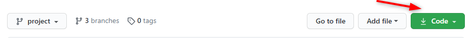

- Then you can open your terminal and type git clone + the link you got from clicking the button clone
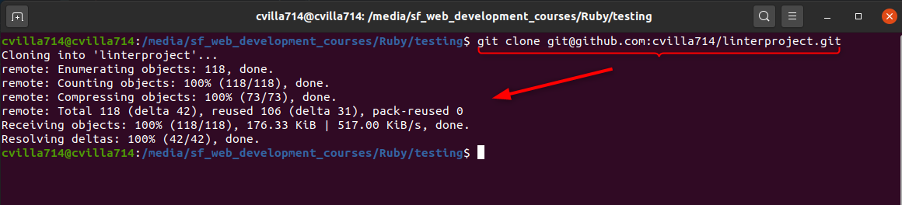

- Once you a copy of the repo you have to navigate into the folder you cloned
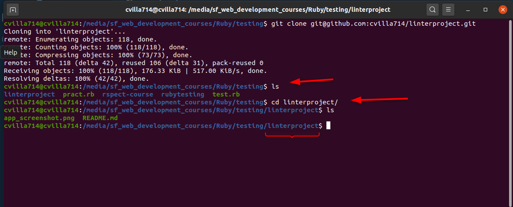

- You will need to run a few commands before you get to test it but don't worry just folow the instructions step by step

- When the require gems are finally installed you can choose to open the project with any Code Editor of your choice.

### Prerequisites

- You will need Ruby install in your machine

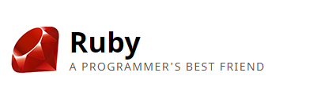

- You will need need a Code Editor

### Install

- You will need to install a few gems to run the project but here are the step by step instructions
- Please run this in your terminal bundle install. This will install all of the dependecies for the project
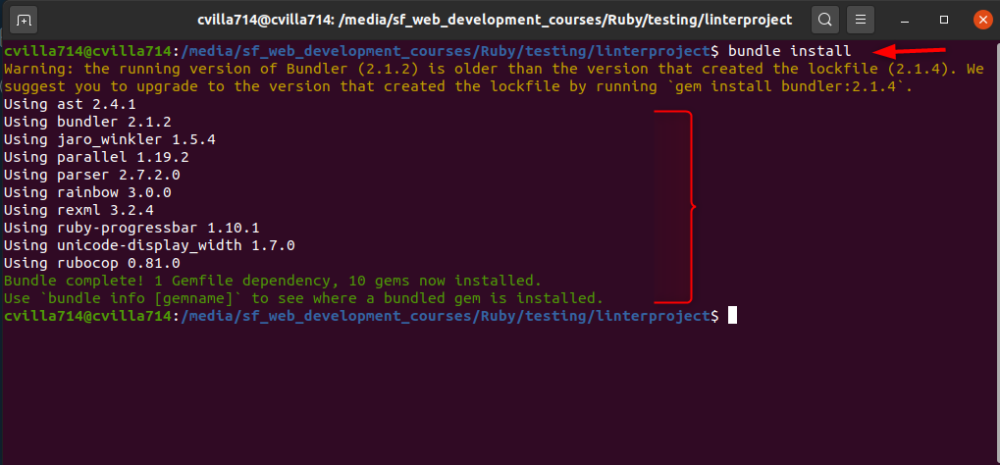

- In your terminal please type the command gem install colorize . Note: You may need to use sudo to install gems
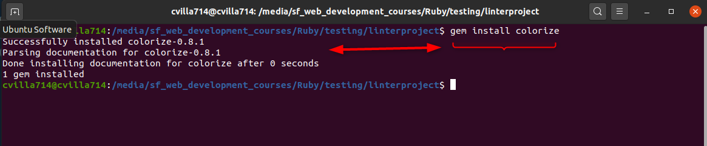

- Onde you are done installing the colorize gem please move to the next step and type this command gem install rspec
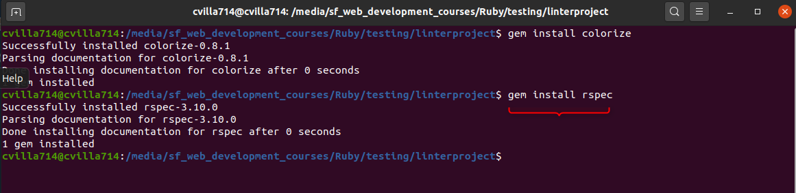

### Usage

- In order to use the program you will need to provide the css file you want to evaluate plesae type this command
- ruby bin/main.rb {filename} without the curly braces and just replace filename for the file you want to test
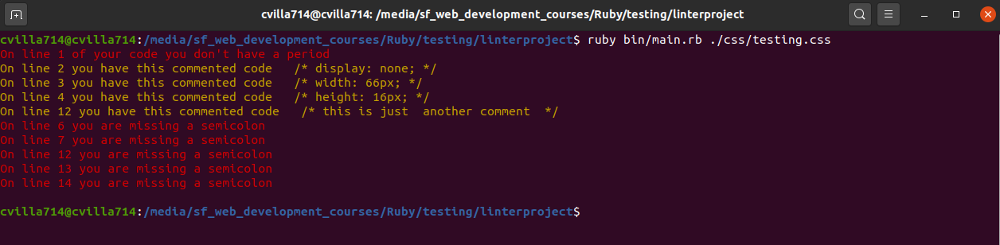

- Now this are the examples of good practice vs bad practice so you can have an idea of what the program is evaluating
- Bad Practice

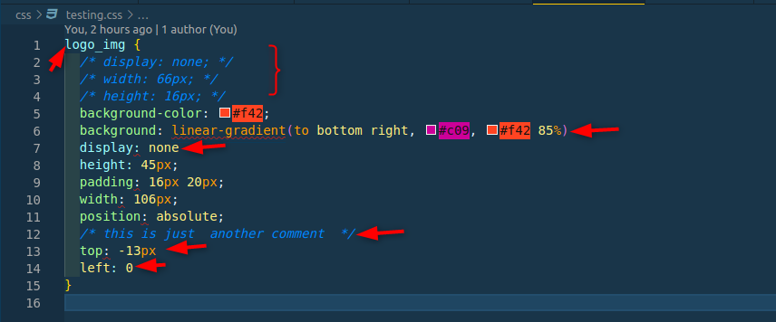

- Good Practice

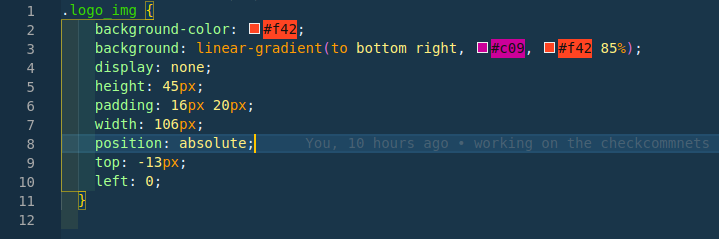

### Run tests

- In order to run the RSpec you will need to type the following command in your terminal rspec 

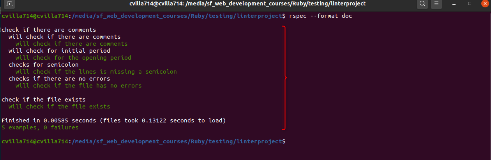

## Authors

👤 **Devkc**

- Github: [@cvilla714](https://github.com/cvilla714)
- Twitter: [@kckeyti](https://twitter.com/kckeyti)
- Linkedin: [linkedin Profile](https://www.linkedin.com/in/cosmel-villalobos-1900531aa/)

## 🤝 Contributing

Contributions, issues, and feature requests are always welcome!

Feel free to check the [issues page](issues/).

## Show your support

Give a ⭐️ if you like this project!